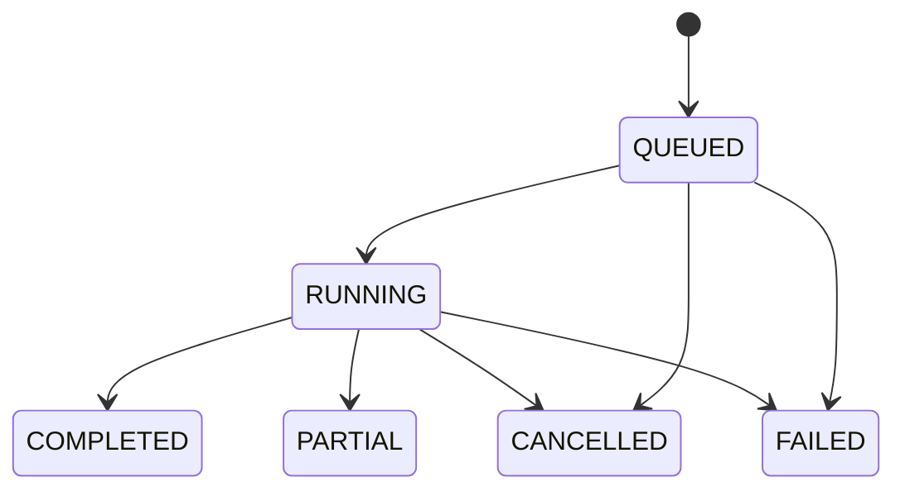

# Kiến trúc WebLens V1 và V1.5

Trạng thái: cập nhật theo ADR-005, ADR-006, ADR-007, E2E TASK-011 và TASK-013
ngày 2026-09-14.

## Trạng thái hiện tại

Repository hiện có React frontend, Java 21/Spring Boot Control Plane, Go Crawler
Service và Playwright Capture Worker. Scan command/progress đi qua outbox/inbox;
crawler lưu workflow trong PostgreSQL và analytical fact trong ClickHouse. Capture
Worker lưu workflow trong PostgreSQL, rendered/network fact trong ClickHouse và
artifact lớn trong MinIO. E2E đăng ký → website → scan → page evidence → capture →
snapshot đã đạt; capacity production vẫn cần benchmark trên phần cứng triển khai.
Clone tĩnh một trang của TASK-013 cũng đã đạt E2E với staged publish, SHA-256,
download owner-scoped và retention GC. Clone website theo ADR-007 revision 3 mặc
định là Design Clone: Control Plane vẫn orchestrate, Capture PostgreSQL vẫn giữ
durable page work, nhưng Capture Worker lọc locale/canonical/query, phân nhóm
semantic role + route template và chỉ dùng Playwright cho ứng viên đại diện.
Assembly deduplicate lần cuối bằng DOM layout fingerprint, deduplicate asset xuyên
page, rewrite link, tạo archive shard không có screenshot, owner-scoped download,
cancellation và GC. Capacity production vẫn cần benchmark trên hạ tầng triển khai.

PostgreSQL production dùng Neon và các deployable chạy Windows-native theo
[ADR-010](adr/ADR-010-windows-native-vps-deployment.md). Kiến trúc ba deployable và cách
sử dụng CrawlObserver được phê duyệt trong
[ADR-005](adr/ADR-005-tach-crawler-thanh-microservice.md). ClickHouse analytical
store được phê duyệt trong
[ADR-006](adr/ADR-006-tich-hop-clickhouse-cho-analytics.md).

## Sơ đồ hệ thống

```mermaid
flowchart TB
    UI[React + TypeScript] -->|HTTPS / JSON| CP[Spring Boot Control Plane]
    CP -->|JDBC / local transaction| CPDB[(Control Plane PostgreSQL)]
    CP -->|Versioned REST, idempotency| CR[Go Crawler Service]
    CR -->|Crawler-owned transaction| CRDB[(Crawler PostgreSQL)]
    CR -->|Batched analytical facts| CHC[(ClickHouse Crawl Analytics)]
    CR -->|Bounded HTTP(S)| TARGET[Website được phép scan]
    CP -->|Versioned capture command| BW[Playwright Capture Worker]
    BW -->|Capture-owned transaction| BWDB[(Capture PostgreSQL)]
    BW -->|Batched network/resource facts| CHB[(ClickHouse Capture Analytics)]
    BW -->|Restricted browser egress| TARGET
    BW -->|Large immutable objects| OBJ[(S3 / MinIO)]
    CR -->|Durable progress/result events| CP
    BW -->|Durable capture events| CP
```

Ba database logic có thể đặt trên cùng PostgreSQL 17 cluster ban đầu, nhưng phải
tách database hoặc schema, role, connection budget và migration ownership. Không
service nào được truy cập bảng private của service khác. ClickHouse là cluster
độc lập với hai logical database/role; local có thể chạy single node, còn topology
production phải dựa trên capacity và availability benchmark.

## Trách nhiệm của từng service

### WebLens Control Plane

- Identity, user session và authorization context.
- Website ownership, normalized registration target và scan eligibility.
- Nhận lệnh tạo/hủy scan/capture, quota và idempotency từ client.
- Public scan/capture lifecycle và projection tiến độ phục vụ UI.
- Dispatch outbox, event inbox/dedup và reconciliation.
- API gateway/BFF cho report; không biến persistence entity thành public contract.

Control Plane giữ cấu trúc modular bên trong. Identity, Website và Scan không được
chia thành deployable riêng trong V1/V1.5.

### Go Crawler Service

- Bản fork CrawlObserver ở repository và release boundary riêng.
- Durable crawl execution, frontier, URL discovery/dedup và per-host scheduling.
- Lease, heartbeat, retry, fencing và recovery cho page work.
- DNS/IP/redirect SSRF policy, timeout, response-size và crawl bounds. Theo
  ADR-011, crawler không cưỡng chế `robots.txt`.
- HTTP page evidence, parsing, basic metrics, links và deterministic findings có version.
- Durable PostgreSQL analytics staging và bounded batch sink sang ClickHouse.
- Report query contract cho page outcome/metrics/findings.
- Durable outbox cho progress, partial result và terminal result.

Normalizer, fetcher, parser, bounded pipeline, retry/politeness, sitemap,
ClickHouse client/batching và report intent của CrawlObserver được tái sử dụng sau
contract test. In-memory manager/frontier, SQLite auth, managed ClickHouse
subprocess, migration gốc, lossy batch buffer, Rod renderer, Cloudflare bypass và
TLS impersonation không được nhập.

### Playwright Capture Worker

- Nhận capture command idempotently cho page đủ điều kiện.
- Chạy Camoufox mặc định trong isolation boundary có timeout và resource limits;
  giữ Chromium như engine tùy chọn qua `CAPTURE_BROWSER_ENGINE=playwright`.
- Thu rendered HTML, screenshot, bounded network metadata và eligible resource.
- Redact secret/cookie/header, hash và upload artifact lớn vào S3/MinIO.
- Persist capture metadata/outbox, batch network/resource facts sang ClickHouse;
  hỗ trợ retry và cleanup object mồ côi.
- Theo revision 2, sở hữu durable site-reconstruction workflow, browser page
  fan-out, cross-page asset dedup và final archive assembly. Crawler vẫn sở hữu
  URL discovery/frontier.
- Theo revision 3, sở hữu deterministic Design Clone selection, DOM fingerprint,
  representative assembly và staging prefix có lifecycle 24 giờ. URL bị loại tận
  dụng page-work row hiện có với terminal status/reason code; không thêm schema.
- Public site-clone command nhận URL thay vì yêu cầu user chọn `scan_id`. Control
  Plane tạo scan mới và truyền opaque `scan_id` nội bộ qua workflow để bảo đảm
  freshness, idempotency, truy vết và resume.
- Render Monitor dùng endpoint progress owner-scoped riêng, đọc snapshot từ
  site-reconstruction jobs/pages hiện hữu; không tạo event store hoặc schema mới.
  Control Plane authorize trước khi chuyển tiếp, không giữ transaction database
  trong lúc gọi worker. UI poll 5 giây, phân trang keyset và tách render khỏi publish.
- ADR-011 thêm browser session in-memory owner-scoped để user tự đăng nhập/nhập
  OTP. Control Plane chỉ proxy screenshot/action sau authorization; cookie ở lại
  trong BrowserContext và không được persist. Một session/process, TTL 10 phút.
- ADR-012 thêm launcher dùng chung cho local headed/stealth thử nghiệm; mặc định
  tắt stealth, không thay discovery hoặc thêm service. Docker dùng Xvfb sẵn có.
- ADR-015 chọn Camoufox Firefox fork làm engine mặc định cho local và VPS
  Windows-native; SeleniumBase đã gỡ. Không chạy browser REST server; SafeProxy,
  context owner scope, TTL, download/SW policy và artifact pipeline vẫn giữ nguyên.

Capture Worker không thực thi HTML/JavaScript trong Control Plane hay Crawler
Service. Browser egress phải bị chặn ở network/container layer, không dựa vào Go
HTTP safe dialer.

## Quyền sở hữu dữ liệu logic

Bảng dưới đây là ownership map, không phải phê duyệt schema vật lý:

| Data owner | Dữ liệu logic |
| --- | --- |
| Control Plane | `users`, `auth_sessions`, `websites`, public `scans`, quota, dispatch outbox, event inbox/projection |
| Crawler PostgreSQL | crawl execution, durable page work, `scan_pages`, host lease, analytics staging, crawler outbox/inbox |
| Crawl ClickHouse | `page_metrics`, `findings`, `page_links` analytical facts |
| Capture PostgreSQL | capture execution, `page_snapshots`, object metadata, analytics staging, capture outbox/inbox |
| Capture ClickHouse | `network_requests`, `captured_resources` analytical facts |
| S3/MinIO | screenshot, rendered HTML/DOM và resource body lớn |

`scan_id`, `website_id`, `owner_id` và capture/page IDs đi qua API dưới dạng opaque
identifier. Chúng không tạo cross-service foreign key. Service nhận ID phải xác
minh contract và scope phù hợp. Crawler không nhận user credential; Capture Worker
chỉ nhận phím nhập qua phiên tương tác owner-scoped và không persist/log giá trị.

ClickHouse thuộc V1/V1.5 theo ADR-006, nhưng không giữ authorization, queue, lease,
cancellation hoặc lifecycle. PostgreSQL và ClickHouse không có distributed
transaction; correctness dựa trên durable staging, logical version, acknowledgement,
watermark và reconciliation.

## Luồng tạo và chạy scan

1. React gửi request có idempotency key tới Control Plane.
2. Control Plane authorize website, enforce quota và persist public scan ở
   `QUEUED` cùng dispatch outbox trong một local transaction.
3. Dispatcher gửi command có version và `scan_id` tới Crawler Service. Timeout
   không chứng minh command thất bại; dispatcher retry cùng idempotency key.
4. Crawler inbox/dedup tạo execution đúng một lần về mặt logic, dù command được
   nhận at-least-once.
5. Crawler claim page work bằng lease/fencing, fetch ngoài transaction rồi commit
   result vào PostgreSQL analytics staging; worker hết lease không ghi đè attempt mới.
6. Sink claim staging theo batch, ghi ClickHouse theo logical key/version rồi
   acknowledgement trong PostgreSQL. Retry không được double count.
7. Crawler persist progress/result event sau khi analytics watermark tiến lên.
   Publisher có thể gửi event nhiều lần.
8. Control Plane inbox áp dụng event idempotently và không cho projection quay
   ngược. UI đọc projection; report page-level đi qua Crawler query contract.
9. Terminalization chỉ xảy ra khi không còn work hợp lệ và analytics watermark đã
   đạt kết quả phải publish; reconciliation xử lý acknowledgement/event bị thiếu.

## Luồng browser capture V1.5

1. Control Plane authorize scan ownership, truy vấn Crawler contract để xác minh
   page đủ điều kiện, rồi persist public capture request/outbox.
2. Capture command mang immutable target snapshot và policy đã giới hạn; worker
   không tự mở rộng quyền dựa trên payload của client.
3. Capture Worker claim job, render/upload ngoài database transaction.
4. Worker commit metadata, object reference và analytical staging bằng local
   transaction có fencing; sink batch network/resource facts sang ClickHouse.
5. Terminal outbox chỉ phát khi analytics watermark đạt capture result cần publish.
6. Upload hoặc ClickHouse insert thành công nhưng PostgreSQL acknowledgement thất
   bại được retry idempotently; inventory dọn object mồ côi sau grace period.
7. Trong V1.5, UI gọi endpoint artifact của Control Plane; Control Plane authorize
   owner rồi stream byte từ Capture Worker với `no-store`, `nosniff` và
   `Content-Disposition` an toàn. UI không nhận credential/object-storage URL và
   không thực thi artifact. Presigned URL chỉ được xem xét lại khi benchmark chứng
   minh proxy streaming là bottleneck.
8. Trong cùng Playwright session, worker ánh xạ raw URL chỉ trong RAM để rewrite
   HTML/CSS, tạo manifest và ZIP clone tĩnh một trang. Query value không được ghi
   vào PostgreSQL, ClickHouse, manifest hoặc log.
9. Worker upload archive ngoài transaction, rồi publish reconstruction metadata
   theo capture lease generation. Stale worker không được công bố artifact thắng;
   clone partial/failed không làm capture evidence thất bại.
10. `reconstruction_jobs` và `reconstruction_artifacts` thuộc Capture Worker
    PostgreSQL; ZIP/manifest nằm trong MinIO và hết hạn sau 7 ngày. Không có
    cross-service FK hoặc distributed transaction.

## Giao tiếp và consistency contract

- V1/V1.5 dùng REST nội bộ + PostgreSQL outbox/inbox; chưa cần Kafka/Redis.
- Command/event có `message_id`, contract version, aggregate ID, sequence/version,
  correlation ID và timestamp; payload có giới hạn kích thước.
- Delivery là at-least-once. Consumer phải dedup và xử lý transactionally với
  local state.
- State/version cũ bị bỏ qua; terminal state không quay lại running.
- Timeout, bounded retry với backoff/jitter, circuit breaking và load shedding
  được cấu hình theo operation, không retry vô hạn trong request thread.
- Không giữ database transaction khi gọi service, website, Chromium hoặc object store.
- Không giữ PostgreSQL transaction khi gọi ClickHouse; analytical delivery là
  at-least-once và query phải version-safe.
- Không có distributed transaction hoặc synchronous chain bắt buộc để trả kết quả
  accepted cho client.

Exact endpoint, event schema, retention và physical outbox/inbox schema cần task
review riêng; tài liệu này không cấp quyền vượt cổng database RED.

## Lifecycle quan sát bởi người dùng



Projection có thể trễ trong SLO đã duyệt, nhưng không được vượt giới hạn, double
count hoặc báo complete khi Crawler chưa commit terminal state. Trạng thái stale
phải hiển thị rõ thay vì suy đoán failure chỉ vì một request nội bộ timeout.

## Bảo mật

- Mọi API user-facing authorize theo owner; opaque ID không phải authorization.
- Service-to-service authentication, authorization, replay protection và secret
  rotation là bắt buộc trước production.
- Crawler kiểm tra URL scheme, DNS result và từng redirect; áp dụng global-unicast
  policy, per-host concurrency/rate và response bounds. Việc bỏ qua robots theo
  ADR-011 không nới bất kỳ network-safety guard nào.
- Capture Worker có network egress allow policy, sandbox, process kill timeout,
  CPU/RAM/disk/network quota và không mount credential không cần thiết.
- Crawled HTML, header, URL, metadata và artifact đều không tin cậy. Không lưu raw
  cookie, authorization header, credential hoặc body nhạy cảm mặc định.
- Source fork CrawlObserver giữ AGPL notices/provenance và có source-offer workflow
  đã được pháp lý review trước production.

## Quan sát và vận hành

- Correlation ID đi xuyên Control Plane, Crawler, Capture Worker và outbox event.
- Theo dõi API latency/error, dispatch age, inbox lag, queue depth/age, lease expiry,
  retry, stale result, per-host rate, DB pool wait, ClickHouse parts/merge/insert
  latency, analytics backlog/watermark, object upload và browser kill.
- Log có cấu trúc nhưng không chứa response body, token, cookie hoặc secret.
- Health check phân biệt process alive, dependency ready và degraded; một data-plane
  service chậm không được kéo sập endpoint auth/report đã có của Control Plane.
- Backup/PITR và connection budget tính cho từng database/service trên toàn cluster.

## Thành phần chưa được phê duyệt

- Kafka, Redis, Kubernetes, service mesh hoặc multi-region orchestration.
- OpenSearch hoặc datastore bổ sung ngoài PostgreSQL, ClickHouse và S3/MinIO.
- Tách Identity, Website, Analysis hoặc Report thành service riêng.
- CAPTCHA solver, TLS impersonation và browser cloud; Camoufox theo ADR-015
  không bảo đảm vượt Cloudflare.
- V2 comparison/regression, V3 AI, V4 monitoring/alerts và các capability về sau.

Mỗi thay đổi trên cần requirement, benchmark hoặc threat model phù hợp và một ADR
mới trước implementation.
